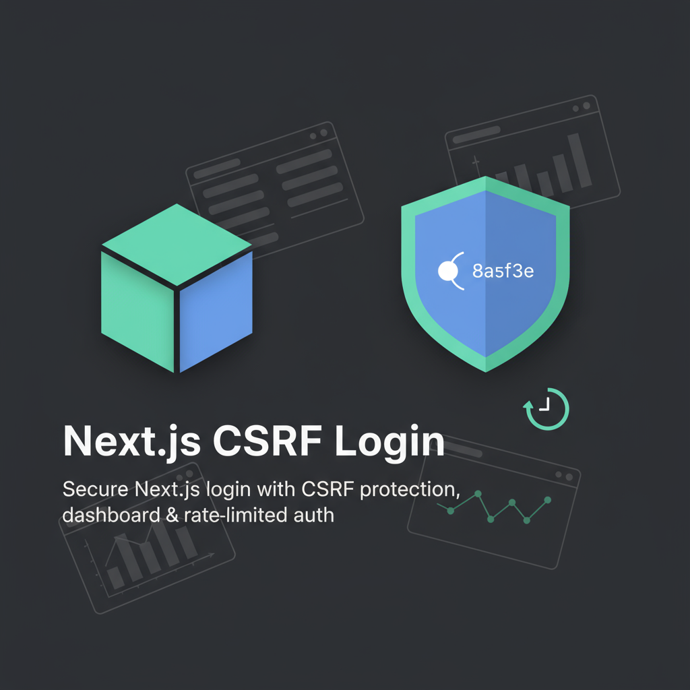

# Next.js CSRF Login

A secure Next.js application featuring a login system with CSRF protection, a dashboard, and rate-limited authentication.



## Overview

This project is a lightweight, secure web application built with Next.js, TypeScript, and Tailwind CSS. It provides a login page, a protected dashboard, and a custom 404 page, with a focus on security through CSRF (Cross-Site Request Forgery) protection, rate limiting, and XSS prevention. The app ensures users can log in securely, access a dashboard, and log out without exposing sensitive data.

### Why CSRF Protection?

CSRF attacks trick users into performing unintended actions (e.g., logging out or submitting forms) by exploiting trusted sessions. This app mitigates this risk by:

- Generating session-bound, single-use CSRF tokens for POST requests (`/api/login`, `/api/logout`).
- Storing tokens in HTTP-only, SameSite=Strict cookies (`XSRF-TOKEN`).
- Validating tokens using a secure HMAC-SHA256 algorithm with `crypto-js`.
- Clearing tokens after each request to prevent reuse.

Additional security features include:

- Rate limiting (5 login attempts per minute per IP).
- XSS prevention via input sanitization.
- POST-only authentication to block query parameter leaks.
- Secure session cookies (`session`, `temp-session`).

## Features

- **Login Page**: Validates email/password with `react-hook-form` and `zod`, clears form on invalid credentials, and refreshes CSRF tokens on failure.
- **Dashboard**: Accessible only to authenticated users, with a clean UI and logout functionality.
- **Custom 404 Page**: Styled with Tailwind, includes a simplified navbar.
- **Navbar**: Shows only the app name on the login page; includes "Dashboard" and "Logout" elsewhere.
- **Success Toasts**: Displays success messages for login and logout using `react-hot-toast`.
- **TypeScript**: Ensures type safety across the app.
- **Tailwind CSS**: Provides a modern, responsive design.

## Try It Live

Visit the live demo at [https://nextjs-csrf-login.vercel.app/login](https://nextjs-csrf-login.vercel.app/login).

**Test Credentials**:

- Email: `user@secureapp.com`
- Password: `SecurePass123!`

## Setup

1. **Clone the Repository**:

   ```bash
   git clone https://github.com/hosseinskia/nextjs-login-csrf.git
   cd nextjs-login-csrf
   ```

2. **Install Dependencies**:

   ```bash
   npm install
   ```

3. **Set Up Environment Variables**:
   Create a `.env.local` file in the root directory:

   ```bash
   CSRF_SECRET=<32-byte-hex-string>
   SESSION_SECRET=<32-byte-hex-string>
   ```

   Generate secrets with:

   ```bash
   node -p "require('crypto').randomBytes(32).toString('base64url')"
   ```

4. **Run the App**:

   ```bash
   npm run dev
   ```

   Access at `http://localhost:3000`.

5. **Build for Production**:

   ```bash
   npm run build
   ```

6. **Test Credentials**:
   - Email: `user@secureapp.com`
   - Password: `SecurePass123!`

## File Structure

- **`app/`**:

  - `globals.css`: Global styles with Tailwind CSS.
  - `layout.tsx`: Root layout with `Navbar` and `Toaster`.
  - `page.tsx`: Home page with a "Sign In" button.
  - `login/page.tsx`: Login form with CSRF-protected submission.
  - `dashboard/page.tsx`: Protected dashboard with logout.
  - `not-found.tsx`: Custom 404 page with simplified navbar.
  - `api/csrf/route.ts`: Generates CSRF tokens.
  - `api/login/route.ts`: Handles login with rate limiting.
  - `api/logout/route.ts`: Clears session and CSRF tokens.

- **`components/`**:

  - `Button.tsx`: Reusable button component.
  - `Header.tsx`: Login page header with logo.
  - `Input.tsx`: Form input with validation feedback.
  - `Navbar.tsx`: Conditional navbar for login and other pages.

- **`lib/`**:

  - `auth.ts`: Manages user authentication and sessions.
  - `security.ts`: Handles CSRF token generation and sanitization.
  - `withCsrf.ts`: Middleware for CSRF validation.

- **`public/`**:

  - `logo.png`: App logo (ensure it exists).

- **Configuration**:
  - `package.json`: Dependencies and scripts.
  - `next.config.ts`: Next.js configuration.
  - `tailwind.config.js`: Tailwind CSS configuration.
  - `tsconfig.json`: TypeScript configuration.
  - `.env.local`: Environment variables for secrets.

## Security Notes

- **Production**: Deploy over HTTPS and use a database/Redis for sessions.
- **Extending**: Use `lib/withCsrf.ts` for custom POST routes:
  ```typescript
  import { withCsrf } from "./lib/withCsrf";
  export const POST = withCsrf(async (request) => {
    return NextResponse.json({ message: "Success" });
  });
  ```
- **Signup**: The "Sign Up" link is a placeholder; implement as needed.

## License

This project is licensed under the [MIT License](LICENSE).
